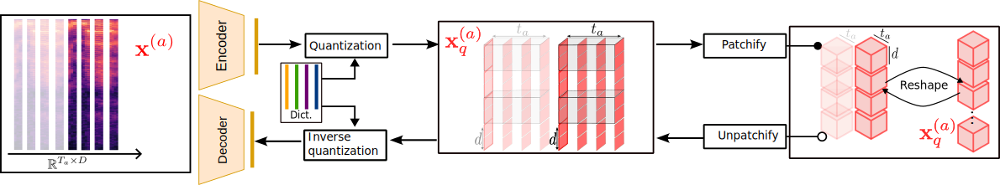
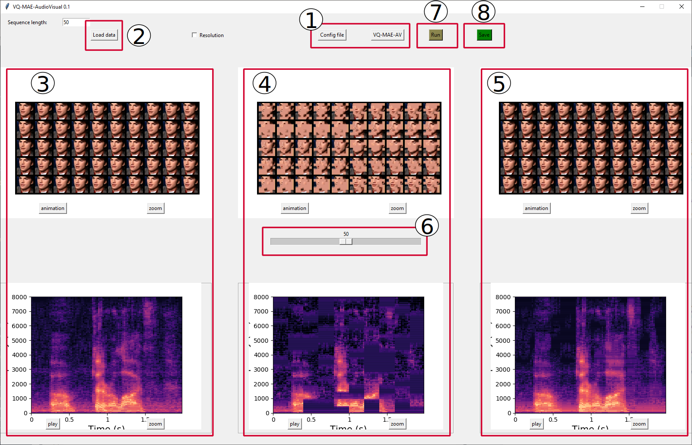

# A vector quantized masked autoencoder for audiovisual speech emotion recognition
[]()
[](https://www.python.org/)
[](https://samsad35.github.io/VQ-MAE-AudioVisual/)

[comment]: <> ([![PyPI version fury.io]&#40;https://badge.fury.io/py/ansicolortags.svg&#41;]&#40;https://test.pypi.org/project/&#41;)


This repository contains the code associated with the following publication:
> **A vector quantized masked autoencoder for audiovisual emotion recognition**<br> Samir Sadok, Simon Leglaive, Renaud Séguier<br>Face and gesture 2024.

If you use this code for your research, please cite the above paper.

Useful links:
- [Paper](https://www.sciencedirect.com/science/article/pii/S1077314225000852)
- [Demo website with qualitative results](https://samsad35.github.io/VQ-MAE-AudioVisual/)

## Setup 
- [ ] Pypi: (Soon) 

[comment]: <> (  - ``````)
- [ ] Install the package locally (for use on your system):  
  - In VQ-MAE-speech directoy: ```pip install -e .```
- [x] Virtual Environment: 
  - ```conda create -n vq_mae_av python=3.8```
  - ```conda activate vq_mae_av```
  - In VQ-MAE-speech directoy: ```pip install -r requirements.txt```

## Usage
* To do:
  * [x] Training VQ-VAE-Speech
  * [x] Training VQ-VAE-Visual
  * [X] Training VQ-MAE-AV
  * [X] Fine-tuning and classification for emotion recognition

### 1) Training Speech VQ-VAE-Specch in unsupervised learning



See the code [train_speech_vqvae.py](train_speech_vqvae.py)
- You can download our pre-trained speech VQ-VAE [following link]() (released soon).

### 2) Training Speech VQ-VAE-Specch in unsupervised learning


See the code [train_visual_vqvae.py](train_visual_vqvae.py)
- You can download our pre-trained speech VQ-VAE [following link]() (released soon).

### 2) Training VQ-MAE-Speech in self-supervised learning


See the code [train_vq_mae_av.py](train_vq_mae_av.py)
- Pretrained models (released soon)

| Model         	| Encoder depth    	| 
|---------------	|---------------------	|
| VQ-MAE-AV 	| [6]() - [12]() - [16]() - [20]() 	|

### 3) Fine-tuning and classification for emotion recognition task

- __cross-validation | Speaker independent__ Follow the file "[classification_speaker_independent.py](classification_speaker_independent.py)".
- __80%/20% | Speaker dependent__ Follow the file "[classification_speaker_dependent.py](classification_speaker_dependent.py)".

### 4) Graphical interface for VQ-MAE-AV


> **User Interface for VQ-MAE-AV**: <br> **(1)** Click the "Config file" button to open a
dialog box for selecting model parameters. Load the model by clicking the "VQ-MAE-AV"
button. **(2)** Use the "Load data" button to open a dialog box for downloading a video to
your computer. The display in **(3)** opens automatically. **(7)** Click the "Run" button, and the
displays **(4)** (showing masked data) and **(5)** (illustrating reconstruction using our model)
will open. **(6)** Use the slider to adjust the masking percentage. **(8)** Click the "Save" button
to save all the data (input, masked data, and reconstruction) to your desired folder path.
201

See the code [test_interface.py](test_interface.py)
```

## License
GNU Affero General Public License (version 3), see LICENSE.txt.
